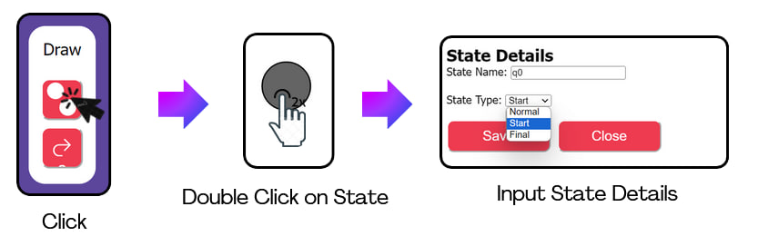

# Automata-Project
<!--  -->
## Features for Automata Project

- Design FA
- Determine FA Type
- Test String
- Convert NFA to DFA
- Minimize DFA
- Save FA and Load FA from JSON file

## The Feature is Completed in UI

- Design FA
- Determine FA Type
- Save FA and Load FA from JSON file

## Lacking Feature in UI
- Test String: This feature is not yet implemented in UI.
- Convert NFA to DFA: This feature is not yet implemented in UI.
- Minimize FA: This feature is not yet implemented in UI.
> [!NOTE]
>  "All these functions are not yet implemented in the UI, but we have already done it in the terminal and can run it to show you."
## User Guide

## Creating a State

First, click on the button in the Draw box and double-click on the canvas to display a state.

By selecting on the drop-down box, you may create a **State type** such as **State state**, **Normal state**, and **Final State**.

**Here are the different types of states**

## Create a transition between states

Click on this button in the Draw box to create a transition between connected state.

"Then, click on the **Start state** and connect it to the **Normal state**. Next, click on the **Normal state** and connect it to the **Final state.** This will display the transitions."

